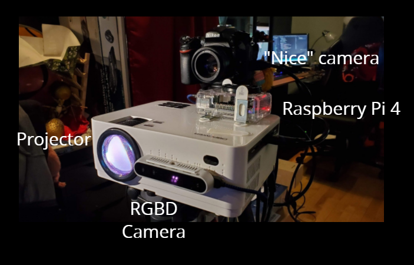
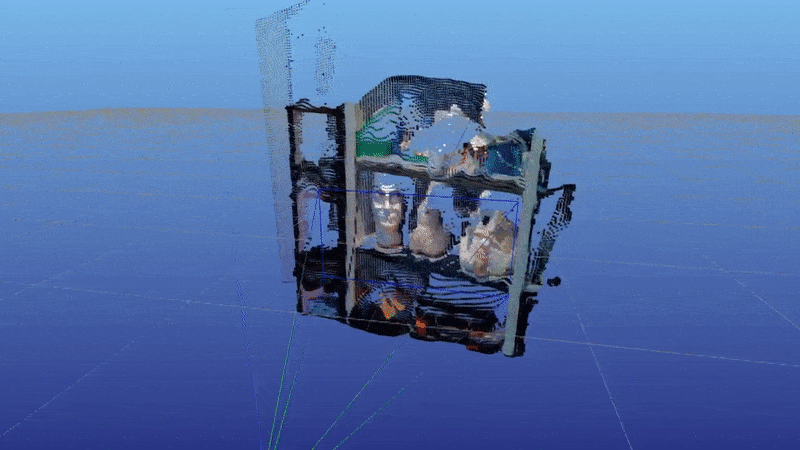

# Dynamic Scene Relighting with Projection Mapping
-------------------------------------
Funded by [MIT Projx](https://projx.mit.edu/) (Spring 2020-Spring 2021). Thanks!

# Overview

This project is aimed at prototyping a "smart flash" for photographers: a camera-mountable lighting unit that can make a scene *look* (to the camera) like it was lit by an arbitrary set of fancy studio lights, without actually needing any of them. The trick is in two parts: one is an RGBD camera, which observes what's going on in front of the camera and estimates scene geometry. The other is a projector, which is mounted close to the camera so that anywhere the camera can see, the projector can illuminate. By simulating the effect of additional desired lights on the scene geometry, we can figure out what the where the additional light would fall, and use the projector to put that additional light out into the scene.

It makes more sense in video form (click image to go to the youtube video):

## Prototype hardware setup and calibration

Prototype unit and its parts are shown below. See a later section for the actual BOM. (This prototype unit clearly isn't mobile as-is, but replacing the projector with a pico-projector, a battery, and a hot-shoe adapter would bring it to about the same form factor as a DLSR flash attachment -- see BOM.)

Calibration -- knowing the precise camera projection matrix for the projector and RGBD camera, and the spatial transform between the two -- is really important, but can be estimated by projected calibration targets with the projector and observing them with the RGBD camera. (See `Calibration Details` below.) The calibration of the DLSR / "nice camera" doesn't matter; though the DLSR must have a FOV <= than the projector, which must have an FOV <= the RGBD camera.

## Geometry reconstruction and projector image generation

[Caption: *Geometry reconstructed by the RGBD camera and visualized as a pointcloud (using [Meshcat](https://github.com/rdeits/meshcat-python)!). The camera is looking at a shelf with some foam heads and stuffed toys.*]

I don't do anything too clever here. The RGBD camera output gives me a point cloud of the scene, from which I can estimate surface normals. The current lighting demos simulate moving lights of different colors. I use the OpenGL graphics pipeline, in combination with some prototype code (that really ought to be moved to OpenGL to make it faster and cleaner!) to generate the projector image: I ask OpenGL to render the points in the cloud from the perspective of the projector, using exactly the projector intrinsics; the resulting image can be given to the projector and projected *back into the world*, and should line up with real-world geometry if lighting is correct. Using the point and normal info and the light locations and colors, each point gets "lit up" in a physically reasonable way, and that lighting gets transferred to reality by the projector.

# Calibration details

Calibration -- in this case, meaning getting a precise quantitative understanding of the camera projection matrices of the RGBD camera and the projector, and a precise estimate of the relative transform between the two -- is really important to get right in this project. (With bad calibration, projected lighting won't line up with real geometry, causing unphysical bleeding around edges, shadows where there shouldn't be any, etc.) What is implemented here is basic and very rough around the edges.

## Details

I collect calibration pairs ([i, j], [u, v, z]); [i, j] being the projector pixel coordinate of a point, and [u, v, z] being the RGBD u, v image coordinate and the corresponding detected depth z at that pixel.

I get these pairs by projecting an [Apriltag AR-tag](https://github.com/AprilRobotics/apriltag/) at a known size and position in the projector image into the scene, and then detecting it with the RGBD camera. I randomize the tag location and rotation and get a couple hundred correspondences, moving my setup around the room to try to get detections at different distances in all parts of the image. (This wound up being surprisingly critical; otherwise the calibration had significant weird biases.)

Given a list of detections, I solve for the projector camera matrix in terms of the x and y focal lengths and centers of projection, simultaneous with the 6DOF transformation between the projector and RGBD camera. I take the RGBD camera calibration reported by the hardware and assume it's good. (However, I haven't checked if it really is good...) This is done in [this Jupyter notebook](https://github.com/gizatt/dynamic_scene_relighting/blob/master/notebooks/test_calibration_optimization.ipynb) as a nonlinear optimization using [Drake](https://drake.mit.edu/), a research robotics toolbox that happens to have some extremely convenient optimization tools built-in.

But then all the elegant magic falls apart, and sometimes I hand-tweak if the calibration isn't good for the particular distance I'm demoing. C'est la vie.

## Personal notes
Much smarter and better ways of doing calibration are out there.
  - *Why* can I still improve my calibration with hand-tweaking? Something is wrong somewhere.
  - I suspect the pinhole model is insufficient and that the projector has some nonlinear distortions near the edges, so I ought to move to a higher-order camera model (see how it's handled [here](https://docs.opencv.org/master/dc/dbb/tutorial_py_calibration.html)). The reason I don't do this now is that it means I have to re-engineer the vertex shader on the lighting prediction side to consume the distrotion parameters and apply them faithfully. Kind of fun! But no time.
  - I'm using very little info per image pair -- 4 correspondences, assuming the tag got detected. There are hundreds of thousands of potential correspondences available if the dense correspondence problem can get solved -- something that might be helped by being able to project high-contrast targets.

# Dependencies and other nuts-and-bolts

This project was designed to run on a Raspberry Pi 4b running Ubuntu 20.04, with an HDMI projector
as the monitor and a Realsense D415 as the RGBD sensor.

## BOM

- Projector: [DBPOWER L21 LCD](https://www.amazon.com/dp/B07VGCGRV2/ref=psdc_300334_t4_B07174LM85)
  - Comment: Did the trick and was a good low-cost start. My main complaint is that it can't focus closer than a meter, so I couldn't get calibration data in that range. To make this unit mobile (e.g. able to mount in a camera hot-shoe), a pico projector like [this one](https://www.amazon.com/dp/B07GY4G5N2/ref=psdc_300334_t1_B0039XRJ5Y) might a good the option, but brightness is an issue. Really, I'd like to try ripping a projector apart and replace the bulb with a camera flash, and have that magically work...
- RGBD Camera: [Intel Realsense D415](https://store.intelrealsense.com/buy-intel-realsense-depth-camera-d415.html)
  - Comment: This has been a great option, but processing at full res is necessary to get good details, and I don't have the Rbpi up to that speed with this pipeline. A lot of optimization, moving stuff to C++, and careful pipelining to utilize more cores might be necessary.
  - Comment: I'm not sure an RGBD camera is even necessary any more. Depth estimation from RGB streams is getting very reliable -- enough that I believe it's even being flown on commercial drones these days. Running that process to get clean depth off a regular RGB camera might actually be computationally cheaper than running and processing the RGBD camera.
- Computer: [Rbpi 4 with case and cooling](https://www.amazon.com/Vilros-Raspberry-Basic-Cooled-Case/dp/B07TKFKKMP/ref=sxin_0_ac_d_pm?ac_md=3-1-QmV0d2VlbiAkNzUgYW5kICQ5MA%3D%3D-ac_d_pm&cv_ct_cx=raspi+4&keywords=raspi+4&pd_rd_i=B07TKFKKMP&pd_rd_r=ba72083b-a89d-4a8a-bf4a-196b3db10398&pd_rd_w=mGKE7&pd_rd_wg=fCiQu&pf_rd_p=0e223c60-bcf8-4663-98f3-da892fbd4372&pf_rd_r=70M4QWXQ8P7DAX9ADTK7&psc=1&qid=1582405524)
  - Comments: Considering adding a [a Rbpi](https://www.amazon.com/MakerFocus-Raspberry-Standard-Expansion-Cellphone/dp/B01LAEX7J0?th=1) and [compatible charger](https://www.amazon.com/Raspberry-Micro-USB-Charger-Raspberry-Pi-Adapter/dp/B00L88M8TE/ref=sr_1_3?keywords=micro+usb+5v+3a&qid=1582406706&s=electronics&sr=1-3) if this kit goes mobile.

## Imperfect notes on environment setup

Use a common venv for all of these steps -- mediapipe wants to install into a venv,
and I haven't figured out how to trick it into producing libraries you can sudo-install
without also building opencv from scratch.

1) Follow [this guide](https://www.dedoimedo.com/computers/rpi4-ubuntu-mate-hw-video-acceleration.html) to get hardware acceleration working for the Rbpi.

2) For Python, need python 3.7, so you'll need the [deadsnacks PPA](https://launchpad.net/~deadsnakes/+archive/ubuntu/ppa).

3) Install from apt `build-essential libopencv-dev python3.7 python3-opencv libgl1-dev freeglut3 freeglut3-dev libglew-dev mesa-utils`. (Something is missing here -- how do I get py3.7 cv2?)

4) Then get `pillow scipy numpy matplotlib pyglet pyopengl meshcat` from pip.

5) Install apriltag core library from `https://github.com/AprilRobotics/apriltag/` (on ~master, or recent enough to have python bindings), following directions. Make sure the python bindings get installed: you may need to `mkdir -p ~/.local/lib/<python version>/site-packages`.

6) Install `librealsense` packages from source following [this page](https://github.com/IntelRealSense/librealsense/blob/master/doc/installation.md). When doing CMake config, make sure the apriltag library is found, enable any examples you want (recommend `BUILD_EXAMPLES` and `BUILD_GRAPHICAL_EXAMPLES` so you at least get `realsense-viewer`), and `BUILD_PYTHON_BINDINGS` is on. I set `PYTHON_INSTALL_DIR` to `/home/gizatt/envs/mp_env/lib/python3.7/dist_packages/pyrealsense2`.

7) For the face detector, install:
  - [tflite](https://www.tensorflow.org/lite/guide/python) for installing TFlite.
  - [MediaPipe](https://google.github.io/mediapipe/getting_started/install.html) [and then python install](https://google.github.io/mediapipe/getting_started/python.html) -- latter requires at least the bazel install from the first one. If you can get bazel binaries of the right version instead, that'd be way faster... bazel builds very slowly. I think adding `build --local_ram_resources=HOST_RAM*.5 --local_cpu_resources=HOST_CPUS-1` to `~/.bazelrc` reduces the odds of bazel crashing the rbpi. I needed to edit `thirdparty/opencv_linux.BUILD` and edit the header directories to point to the `opencv4` locations instead.

## Commands to set up a new terminal and run

Via SSH (default 192.168.0.142 on home net))
1) SSH in
2) `export DISPLAY=:0.0`
3) `source ~/envs/mp_env/bin/activate`
4) Invoke script with python3.7.

The main demo script is `run_depth_coloring_demo.py`, which is meant to be run over SSH (with the above instructions followed so the screen output goes to the projector). It gives a really simple text interface over SSH to control the demo.
